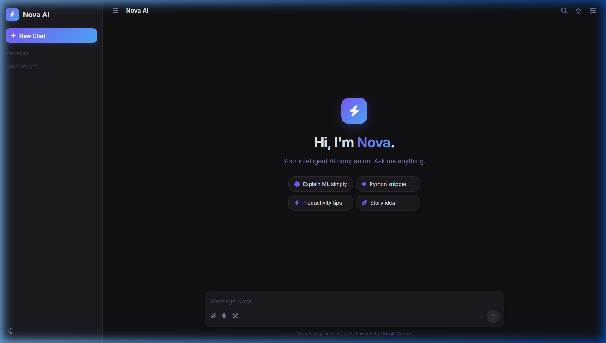
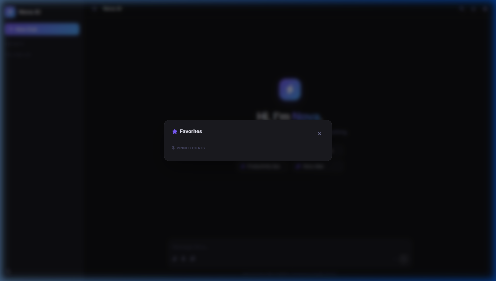
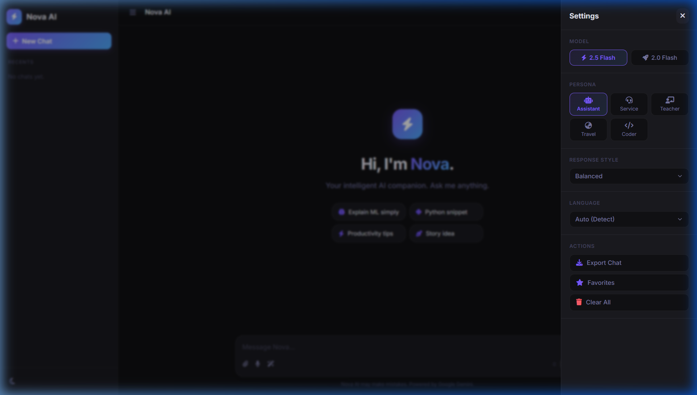

<div align="center">


# ⚡ Nova AI — Intelligent Chat Assistant

**A sleek, full-featured AI chatbot powered by Google Gemini, built with Flask.**

[](https://python.org)
[](https://flask.palletsprojects.com)
[](https://ai.google.dev)
[](LICENSE)

[🚀 Features](#-features) · [📸 Screenshots](#-screenshots) · [⚙️ Installation](#️-installation) · [🗂️ Project Structure](#️-project-structure)

</div>

---

## 📖 About

**Nova AI** is a modern, production-ready AI chat assistant built on top of Google's **Gemini 2.0 Flash** model. It features a premium dark-mode UI, multi-session management, real-time streaming, and a suite of productivity tools — all packaged into a lightweight Python + Flask app.

---

## ✨ Features

### 💬 Core Chat & Multimodal
- **Real-time Streaming (SSE)** — Watch responses appear live as they are generated.
- **Multimodal Support** — Upload **Images, PDFs, or Text files** and discuss them with the AI.
- **Response Styles** — Choose between **Precise**, **Balanced**, or **Creative** modes.
- **Multi-turn conversations** with full context memory per session.
- **Markdown & Code** — Full support for tables, lists, and syntax-highlighted code blocks with copy buttons.

### 🗂️ Smart Session Management
- **Pinned Chats** — Star your favorite sessions to keep them at the top of your history.
- **Unified Favorites** — A central modal to view all your pinned chats and saved message snippets.
- **Organized Sidebar** — Clean, profile-free layout focused on your conversations.
- **Auto-titling** — Sessions are named automatically based on your first message.
- **Rename & Delete** — Full control over your chat history.

### 🔍 Customization & Tools
- **Language Selection** — Force the AI to respond in specific languages (Indonesian, English, etc.).
- **Prompt Library** — Pre-built templates for emails, debugging, summarization, and translation.
- **Search & Highlight** — Instantly find keywords across any conversation.
- **Export Chat** — Download your full conversation history as a formatted `.txt` file.

### 🎨 Premium UI/UX
- **Ambient Glow Interface** — A custom-crafted dark mode with glassmorphism effects.
- **Light/Dark Toggle** — Seamlessly switch themes with persistence.
- **Mobile Responsive** — Fully optimized for desktop, tablets, and smartphones.
- **Character Counter** — Real-time tracking with visual status indicators.

---

## 📸 Screenshots

> *Main Interface — Premium Dark Mode*



> *Unified Favorites Modal — Managing pinned chats and saved messages*



> *Contextual Settings — Adjusting Response Style and Language*



---

## ⚙️ Installation

### Prerequisites
- Python 3.10 or higher
- A [Google Gemini API Key](https://aistudio.google.com/app/apikey)

### 1 — Clone the repository
```bash
git clone https://github.com/K4izox/HACKTIV8-Project.git
cd HACKTIV8-Project
```

### 2 — Install dependencies
```bash
pip install -r requirements.txt
```

### 3 — Set up Environment
Create a `.env` file from the example:
```bash
cp .env.example .env
```
Add your key to `.env`:
```env
GEMINI_API_KEY="YOUR_GEMINI_API_KEY_HERE"
```

### 4 — Run the app
```bash
python app.py
```
Visit `http://127.0.0.1:5000` in your browser.

---

## 🔌 API Endpoints

| Method | Endpoint | Description |
|--------|----------|-------------|
| `POST` | `/chat/stream` | Real-time text chat streaming |
| `POST` | `/chat/upload` | Multimodal chat with file attachments |
| `GET`  | `/api/sessions` | List all available chat history |
| `GET`  | `/api/sessions/<id>` | Retrieve full history/settings of a session |
| `POST` | `/api/sessions/<id>/rename` | Rename a specific chat |
| `DELETE` | `/api/sessions/<id>` | Permanent removal of a session |

---

## 📦 Tech Stack
- **Backend:** Flask, Google Generative AI SDK, Python-Dotenv, Requests
- **Frontend:** Vanilla JavaScript (ES6+), CSS3 (Custom Variables), Marked.js, FontAwesome

---

<div align="center">

Made with ❤️ by [K4izox](https://github.com/K4izox)

⭐ **Star this repo if you found it useful!**

</div>
